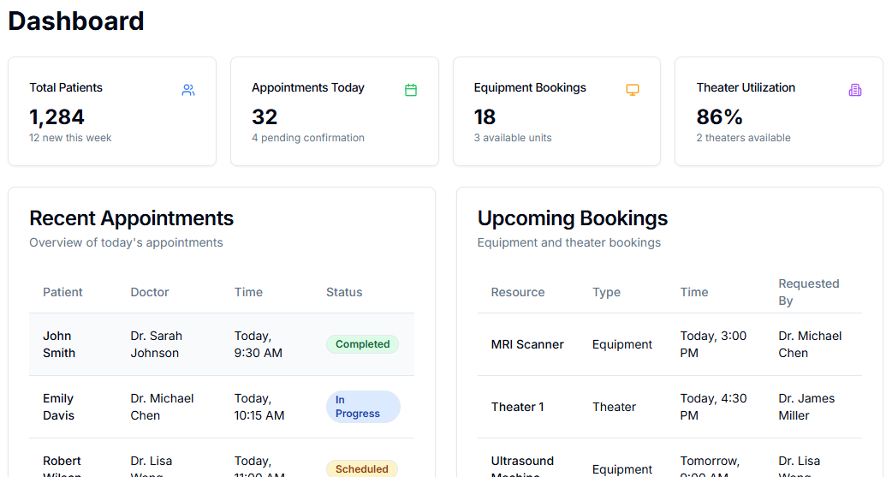
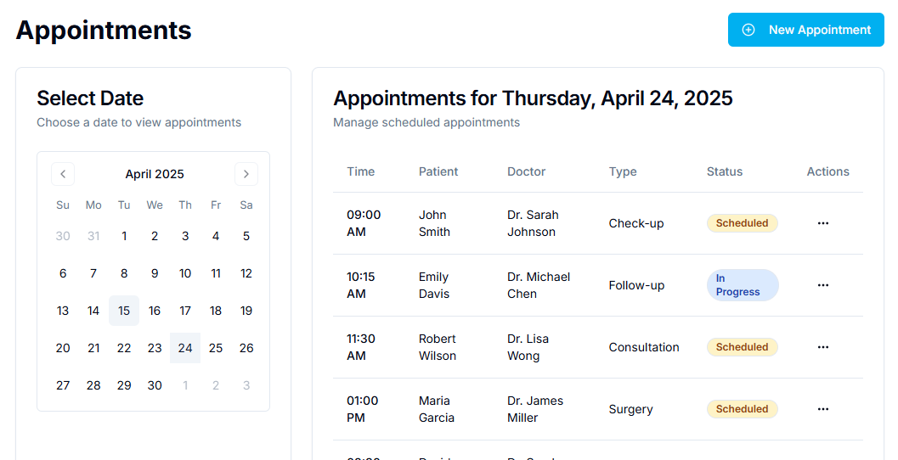
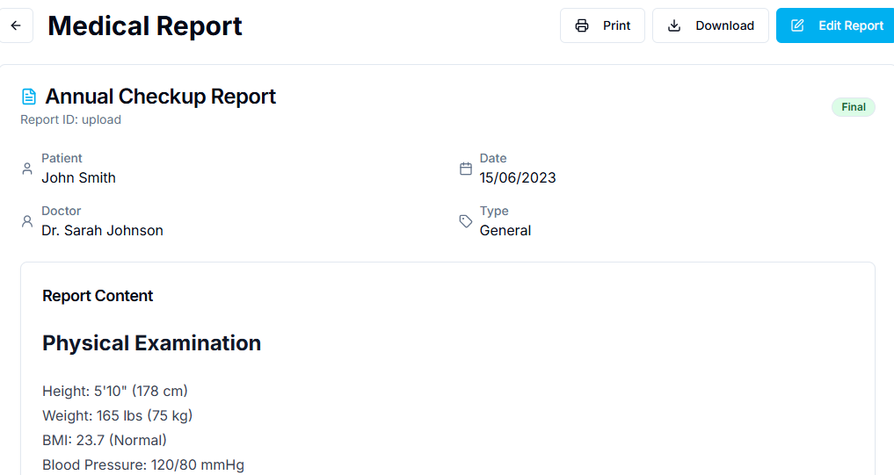

# 🏥 BrikShah Clinic System

The **BrikShah Clinic System** is a comprehensive, full-stack medical clinic management platform built with **Django** (backend), **React.js** (frontend), and **MySQL** (database). It offers streamlined workflows for scheduling, patient records, equipment management, medical reports, and more — designed to support both administrators and healthcare providers.

---

## 🔑 Key Features

### 📅 Appointment Management
- Schedule, reschedule, and cancel appointments
- Assign doctors to patients
- View appointment reports (daily, monthly, per doctor or patient)

### 🧑‍⚕️ Patient & Doctor Profiles
- Add, update, or deactivate patients and doctors
- Centralized view of medical history and visit logs

### 🩺 Equipment & Theater Booking
- Book or cancel equipment and operating theaters
- Set availability statuses: Available, In Use, Maintenance, Closed
- Monthly summaries and daily usage logs

### 🗂 Medical Reports
- Upload PDF medical documents (forms, x-rays, lab scans)
- Controlled access (per doctor/nurse)
- Generate summaries and download specific reports by date/type

---

## ⚙️ Tech Stack

| Layer       | Technology               |
|-------------|--------------------------|
| Frontend    | React.js, Axios, Tailwind CSS     |
| Backend     | Django, Django REST Framework |
| Database    | MySQL                    |
| File Upload | Django File Storage (PDFs) |
| Styling     | Tailwind or Plain CSS   |

---

## 🗃 Project Structure

```
dbms/
│
├── backend/                   # Django backend project
│   ├── appointments/          # Appointment management
│   ├── doctors/               # Doctor profile management
│   ├── patients/              # Patient profile management
│   ├── equipment/             # Equipment booking
│   ├── theaters/              # Theater booking
│   ├── reports/               # Medical report handling
│   └── ...
│
├── frontend/                  # React.js frontend
│   ├── src/
│   │   ├── components/        # Reusable UI components
│   │   ├── pages/             # Page-level views
│   │   └── App.jsx
│   └── ...
│
├── README.md
```

---

## 🚀 Getting Started

### 1. Clone the Repository

```bash
git clone https://github.com/QUASAR378/DBMS.git
cd brikshah-clinic
```

### 2. Backend Setup (Django + MySQL)

```bash
cd backend
python -m venv env
source env/bin/activate  # On Windows: env\Scriptsctivate
pip install -r requirements.txt
```

✅ **Before running**, configure MySQL settings in `backend/settings.py`.

```bash
python manage.py makemigrations
python manage.py migrate
python manage.py runserver
```

### 3. Frontend Setup (React.js)

```bash
cd frontend
npm install
npm run dev
```

---

## 🔌 API Overview

| Endpoint                         | Method | Description                        |
|----------------------------------|--------|------------------------------------|
| `/api/patients/`                 | GET/POST | List or create patient             |
| `/api/appointments/`            | POST   | Schedule or update appointment     |
| `/api/reports/upload/`          | POST   | Upload medical report (PDF)        |
| `/api/reports/summary/`         | GET    | View report summaries              |

> Full API docs coming soon...

---

## 📂 Example Use Cases

- Doctor logs in to view today’s appointments.
- Nurse uploads a PDF lab report with doctor-limited access.
- Admin books equipment for a surgery next week.
- Patient history and report summary exported for medical review.

---

## 🧪 Testing Tips

Use Django Admin or tools like Postman to test API endpoints.  
Unit tests and sample fixtures can be added for each model.

---

## ✨ Contributors

- **[NATASHA]**  
- **[CHRISPIN]**
- **[MIREILLE]** 
- **[EVANS]**  
- **[DEREK]**
- **[PATROBA]**
- **[JUSTIN]**
- **[VICTOR]**

---


## 📸 Screenshots

### 🖥️ Dashboard


### 📅 Appointment Calendar


### Medical Report
